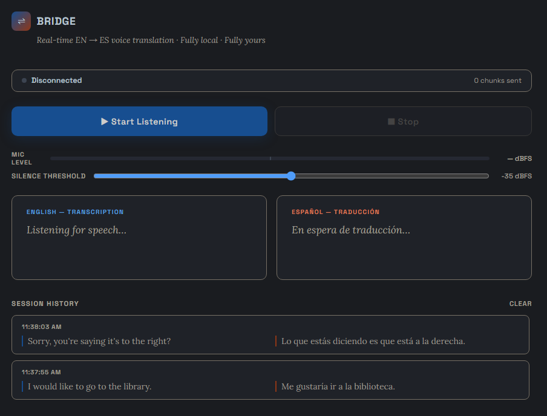

# Bridge — Real-Time Voice Translation

[](https://github.com/ysomu88/bridge/actions)

## 🎤 What is Bridge?

**Bridge** is a local, real-time voice-to-voice translation engine that runs entirely on your local machine. Speak in Spanish and hear your words translated to English instantly — featuring live streaming subtitles, optimized low-latency voice detection, and immediate audio feedback.

No cloud APIs. No subscriptions. 100% private, local compute.

<div align="center">
  
</div>

---

## ✨ Features

* 🎙️ **Real-time translation** — Low end-to-end processing latency.
* 🚀 **Streamlined Audio Pipeline** — Transmits raw Float32 PCM audio arrays natively over WebSockets directly into NumPy memory arrays at C-speed, eliminating heavy container decoding steps.
* 📝 **Live subtitles** — Spanish transcription and English translation rendered side by side.
* 🔊 **Natural voice output** — Ultra-fast inference via `kokoro-onnx` streamed directly back to your browser client.
* 🎚️ **Optimized VAD Detection** — Configured for natural human conversational pauses (~400-500ms), reducing delivery delay when you finish speaking.
* 🔒 **100% local** — Zero data leaves your machine.
* 💻 **Low VRAM footprint** — Fits comfortably on an 8 GB VRAM budget (optimized and tested on an RTX 3070 Ti running Windows 11).
* 🌐 **Remote Sharing Ready** — Securely tunnel your pipeline to let external clients use your GPU for computing right from their mobile or desktop web browsers.
* 🎤 *Additional language support coming soon (only ES/EN available now)*

---

## 🚀 Quick Start

### Prerequisites

* Python 3.12 (Managed via `uv` recommended)
* NVIDIA GPU with CUDA 12.x runtimes
* [Ollama](https://ollama.com) installed locally
* Node.js & npm (for hosting public tunnels via `winget install OpenJS.NodeJS`)

### 1. Set up the environment

Clone the repository and spin up your virtual environment using `uv` for speed:

```powershell
uv venv .venv --python 3.12
.\.venv\Scripts\Activate.ps1
uv pip install -r requirements.txt

```

### 2. Pull the translation engine

Ensure your local Ollama environment is populated with the matching execution model:

```powershell
ollama pull llama3.2

```

---

## ⚡ Automation & Execution

You can run the stack using manually separated terminal shells, launch it with one-click automation profiles, or expose it securely to an external user.

### Option A: Hosting for Remote Users (Recommended for External Access)

Browsers block microphone permissions over insecure connections. To let a remote friend open your application and stream their microphone directly into your local GPU pipeline, use the built-in tunnel script:

```powershell
# Ensure python server.py is running in another terminal window first, then:
.\run_bridge.ps1

```

*(This automatically grabs your public IP address, copies it to your clipboard to use as the tunnel password, and hosts a secure, customized public endpoint like `https://bridge.loca.lt` so your remote user can connect instantly).*

### Option B: Native VS Code Task Automation

If developing locally inside VS Code, a workspace task runner is ready out-of-the-box.

1. Open the project root folder in VS Code.
2. Press **`Ctrl + Shift + B`**.
3. VS Code will spin up a parallel terminal cluster, launch your background Ollama engine, load the `uv` environment, and boot your FastAPI instance concurrently.

### Option C: Manual Local Launch

If you prefer managing the terminals independently for local testing:

```powershell
# Terminal 1: Background Engine
ollama run llama3.2

# Terminal 2: Python Application Server
.\.venv\Scripts\Activate.ps1
python server.py

```

Open your browser to **`http://localhost:8000`**, click **▶ Start Listening**, and speak.

---

## 🎚️ Tuning the silence threshold

If translation execution fails to trigger after you finish speaking, your ambient background noise floor might sit above the digital Voice Activity Detection (VAD) threshold.

Watch the **Mic Level** meter while remaining completely silent. The signal should sit below the threshold marker. If it peaks or hovers over it, adjust the **Silence threshold** slider rightwards until your room's resting noise level rests below the trigger ceiling.

| Environment Profile | Suggested Target Range |
| --- | --- |
| Isolation / Quiet Room | -40 to -35 dBFS |
| Standard Room / Office | -32 to -28 dBFS |
| Busy / Noisy Environment | -25 to -20 dBFS |

---

## 📁 File Architecture

| File | Subsystem Role |
| --- | --- |
| `server.py` | FastAPI Asynchronous Backend — WebSocket lifecycle, Faster-Whisper STT, Ollama API translation interface, `kokoro-onnx` TTS pipeline. |
| `index.html` | Client Interface — Native HTML5 Audio capture, raw PCM stream conversion, live VAD monitoring, side-by-side subtitle render matrix. |
| `run_bridge.ps1` | Native PowerShell reverse-tunnel automation script (handles IP clipboard capture and custom `localtunnel` parameters). |
| `.vscode/tasks.json` | Project-scoped background build task orchestrator. |
| `requirements.txt` | Explicit Python tracking matrix (`uv` optimized). |
| `.gitignore` | Securely blocks local model blobs (`*.onnx`, `*.bin`), user variables (`.env`, `.secrets`), and your local workspace caching states (`.vscode/` tracking overrides). |

---

## 🔧 Troubleshooting

**"The system ignores or clips my speech mid-sentence"**
→ Your VAD configurations in `server.py` may be set tighter than your natural breathing cadences. Try resetting the trailing silence evaluation constants closer to human baseline breathing loops (`0.4` or `0.5` seconds) to balance speech continuity with speed.

**"The tunnel drops incoming audio streams or errors out when a second user connects"**
→ The application enforces an asynchronous execution lock (`processing_lock = asyncio.Lock()`) to protect your 8GB VRAM envelope from race conditions. Only one utterance can pass through the GPU pipeline at a time. Consecutive overlapping streams from concurrent users will be dropped or queued until the lock clears.

**"The term '.\run_bridge.ps1' is not recognized..."**
→ If Windows blocks script execution due to localized execution profiles, run this single assignment command in your PowerShell terminal frame to permit local runtime execution:

```powershell
Set-ExecutionPolicy -ExecutionPolicy RemoteSigned -Scope Process

```

**"Ollama not reachable"**
→ Ensure the Ollama background host engine is executing. Run `ollama run llama3.2` to verify local availability.