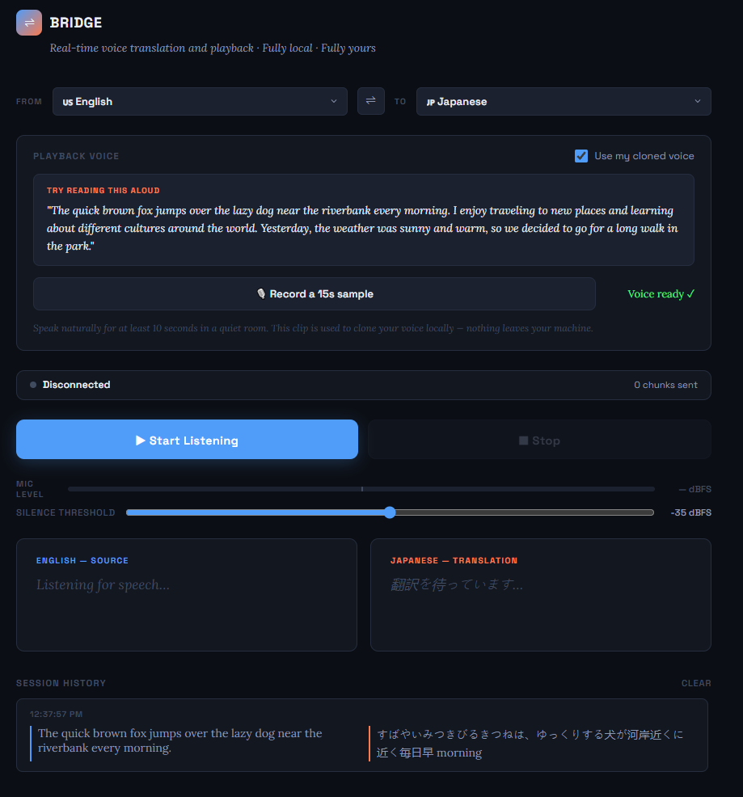

# Bridge — Real-Time Voice Translation

## 🎤 What is Bridge?

**Bridge** is a local, real-time voice-to-voice translation engine that runs entirely on your machine. Speak in any supported language and hear the translation spoken back instantly — with live streaming subtitles and immediate audio feedback.

No cloud APIs. No subscriptions. 100% private, local compute.

<div align="center">
  

  [](https://github.com/ysomu88/bridge/actions)
</div>

---

## ✨ Features

- 🎙️ **Real-time translation** — Low end-to-end processing latency
- 🌍 **11 languages supported** — English, Spanish, French, Italian, Japanese, Chinese, Hindi, Korean, Portuguese, German, and Telugu
- 🔄 **Any direction** — Pick source and target from dropdowns, swap with one click
- 🚀 **Streamlined audio pipeline** — Raw Float32 PCM sent directly over WebSocket into NumPy, no container decoding overhead
- 📝 **Live subtitles** — Source and translation rendered side by side, updating in real time
- 🔊 **Natural voice output** — Ultra-fast TTS streamed back to your browser, with automatic sample-rate adaptation so Kokoro, Piper, and cloned voices all play at the correct pitch
- 🎙️ **Voice cloning playback** — Optionally hear the translation in *your own voice* from a 15-second sample, instead of a preset voice
- 💻 **Low VRAM footprint** — Fits comfortably on 8 GB VRAM (tested on RTX 3070 Ti, Windows 11)
- 🌐 **Remote sharing ready** — Tunnel your pipeline so external users can connect from any browser
- 📱 **Any browser, any device** — Capture-rate resampling, Safari-friendly recording fallbacks, and gesture-unlocked playback work across iOS/Android phones, tablets, and desktops
- 🔇 **Speaker-safe audio** — You never hear your own microphone, and speech detection pauses briefly while translation audio plays so speakers can't feed the output back into the mic

---

## 🌍 Supported Languages

| Language | Speak (STT) | Translate | Voice (TTS) | Voice Cloning |
|---|---|---|---|---|
| 🇺🇸 English | ✅ | ✅ | ✅ | ✅ |
| 🇪🇸 Spanish | ✅ | ✅ | ✅ | ✅ |
| 🇫🇷 French | ✅ | ✅ | ✅ | ✅ |
| 🇮🇹 Italian | ✅ | ✅ | ✅ | ✅ |
| 🇯🇵 Japanese | ✅ | ✅ | ✅ | ✅ |
| 🇨🇳 Chinese | ✅ | ✅ | ✅ | ✅ |
| 🇮🇳 Hindi | ✅ | ✅ | ✅ | ✅ |
| 🇧🇷 Portuguese | ✅ | ✅ | ✅ | ✅ |
| 🇩🇪 German | ✅ | ✅ | ✅ | ✅ |
| 🇰🇷 Korean | ✅ | ✅ | ⏳ | ✅ |
| 🇮🇳 Telugu | ✅ | ✅ | — | — |

> **Voice Cloning** means hearing the translation in *your own voice* via the Playback Voice panel (powered by Chatterbox). Every language in the table except Telugu supports cloning — including German and Korean, which Chatterbox handles natively even though the preset voice for those depends on Piper.
>
> German preset voice output uses the Piper voice bundled in `piper_voices/`. Korean preset voice output works the same way once you add the voice files (`piper-kss-korean.onnx` + `.json`) to `piper_voices/` — see `DOCUMENTATION.md` for download instructions. Telugu currently renders subtitles only; no TTS voice or voice cloning is available for it yet.

---

## 🎙️ Voice Cloning Playback

Instead of hearing translations in a preset voice, you can clone your own voice from a short recording and have translations played back as if you said them.

1. Click **Record a 15s sample** in the Playback Voice panel and speak naturally for the full 15 seconds — the recording stops automatically
2. Once uploaded, check **Use my cloned voice**
3. Start a session as normal — translated audio now plays back in your own voice

> Voice profiles are **per-session and in-memory** — re-record whenever you connect from a new browser, device, or incognito tab. The status bar shows which voice is active (🎙️ Your voice / 🗣️ Preset); if a clone finishes uploading *after* you've already started listening, Bridge adopts it mid-session automatically.

Voice cloning supports a different language list than the rest of Bridge:

Arabic, Danish, German, Greek, English, Spanish, Finnish, French, Hebrew, Hindi, Italian, Japanese, Korean, Malay, Dutch, Norwegian, Polish, Portuguese, Russian, Swedish, Swahili, Turkish, Chinese

If your target language isn't on that list (Telugu, for example), or if cloning fails for any reason mid-session, Bridge falls back automatically to the normal preset voice — translation never stops working.

Recording works in every modern browser — including iOS/iPadOS Safari, which records in MP4/M4A — so cloned voice works on iPhones and iPads too.

Recorded voice samples are stored locally in `voice_samples/` and never leave your machine. They are deleted on graceful shutdown, and any leftovers from a hard stop or crash are swept automatically at the next startup. They are not committed to git.

> For best results, match the language of your reference recording to your most common target language. If they differ, the cloned voice may carry a slight accent from the reference clip's language.

---

## 🧭 How to Use (for new users)

### 1. Set up your language pair
- The **From** dropdown is the language you'll speak; the **To** dropdown is the language you'll hear back.
- Use the **⇌** button to swap them instantly.

### 2. Record your voice sample (for cloned voice)
- Read the sample phrase aloud **naturally, in a quiet room, for at least 10 seconds** (the button auto-stops at 15s).
- Wait for the status to show **Voice ready ✓**.
- Make sure **Use my cloned voice** is checked — it auto-checks after recording.

> The sample is used **only for that session** and is deleted when the server shuts down, so you'll re-record each time you connect.

### 3. Start listening
- Click **▶ Start Listening** — that's the only setup you need. Grant mic access when prompted.
- The status should show **Listening…**.

### 4. Just speak
- Bridge listens continuously. As soon as you **pause after a sentence**, it automatically starts translating — **no buttons to press between sentences**.
- The status changes to **Processing…** while it works.
- The transcription appears on the left, the translation on the right.
- You'll hear the translation played back in **your cloned voice**.

### 5. Stop when you're finished
- Click **⏹ Stop** only when you're done.

### ⏳ About playback delay
There is an expected **5–20 second delay** between speaking and hearing playback. This is the transcription + translation + voice-cloning pipeline doing its work — **not a bug**. Over a remote connection, latency can make this feel longer. Watch for the **Processing…** status to confirm work is happening.

### ❓ Quick tips
- If the mic level bar isn't moving, check browser mic permission and that the correct mic is selected.
- If speech isn't detected, lower the **silence threshold** slider (more negative, e.g. toward -50 dBFS).
- If you don't hear playback, raise your volume and make sure the tab isn't muted.
- Bridge silences the live mic monitor, so you never hear yourself echo — playback is safe over **headphones or speakers**.
- On speaker setups with weak echo cancellation, Bridge briefly pauses speech detection while translation audio is playing, so the output can't feed back into the mic.
- If you talk continuously for 30+ seconds without a pause, Bridge force-processes what it has so far and keeps listening — pause briefly between sentences for the cleanest results.
- Bridge translates anything the mic hears in the source language — nearby speech, a second speaker, or a nearby TV will be picked up. Headphones keep the conversation to yourself.

---

## 🚀 Quick Start

### Prerequisites

- Python 3.12 (managed via `uv`)
- NVIDIA GPU with CUDA 12.x drivers
- [Ollama](https://ollama.com) installed locally
- [eSpeak NG](https://github.com/espeak-ng/espeak-ng/releases/latest) installed (required for non-English voice output)
- Node.js & npm (for remote tunnel via `winget install OpenJS.NodeJS`)

> Voice cloning is optional and loads automatically if `chatterbox-tts` installs successfully. It adds roughly 2-3 GB VRAM on top of the rest of the stack. If it fails to load, Bridge logs a warning and falls back to preset voices — nothing else breaks.

### 1. Set up the environment

```powershell
uv venv .venv --python 3.12
.\.venv\Scripts\Activate.ps1
uv pip install -r requirements.txt
```

### 2. Pull the translation model

```powershell
ollama pull llama3.2
```

---

## ⚡ Running Bridge

### Option A: One-click local launch

```powershell
.\start.ps1
```

Opens Ollama in a separate terminal, waits until it actually responds on `localhost:11434`, then activates the environment and starts the server. (On a cold start Ollama can take a while — the script polls for up to ~30 seconds before stopping with a clear error.)

### Option B: Remote access via tunnel

Browsers block microphone access over plain HTTP. To share Bridge with a remote user:

```powershell
# In one terminal — start the server
.\.venv\Scripts\Activate.ps1
python server.py

# In another terminal — open the tunnel
.\run_bridge.ps1
```

This exposes a secure public endpoint at **https://bridge.loca.lt** so anyone can connect directly to your local GPU pipeline from their browser.

> For safety, Bridge only accepts WebSocket connections whose Origin matches the Host they were opened against — so a random web page can't drive your GPU from another site. If you expose Bridge through a custom proxy that rewrites the Host header, add the extra origin to the `BRIDGE_ALLOWED_ORIGINS` environment variable (comma-separated).

### Option C: Manual

```powershell
# Terminal 1
ollama serve

# Terminal 2
.\.venv\Scripts\Activate.ps1
python server.py
```

Then open **http://localhost:8000**, pick your languages, click **▶ Start Listening**, and speak.

---

## 🎚️ Tuning the silence threshold

If translation doesn't trigger after you stop speaking, your background noise floor may be above the VAD threshold. Watch the **Mic Level** bar while silent — it should sit below the marker line. Drag the **Silence threshold** slider right until the resting noise level falls below the marker.

| Environment | Suggested threshold |
|---|---|
| Quiet room | -40 to -35 dBFS |
| Normal office | -32 to -28 dBFS |
| Noisy environment | -25 to -20 dBFS |

---

## 📁 Files

| File | Purpose |
|---|---|
| `server.py` | FastAPI backend — WebSocket, Whisper STT, Ollama translation, Kokoro/Piper/Chatterbox TTS |
| `index.html` | Browser client — mic capture, VAD, subtitle display, audio playback |
| `start.ps1` | One-click local launch — boots Ollama, waits for it, starts the server |
| `run_bridge.ps1` | One-click remote tunnel launcher (localtunnel → https://bridge.loca.lt) |
| `requirements.txt` | Python dependencies |
| `DOCUMENTATION.md` | Full architecture and technical reference |
| `voice_samples/` | Locally recorded voice cloning reference clips (gitignored, swept at startup/shutdown) |
| `piper_voices/` | Optional Piper TTS voices — German is bundled; add the Korean voice to enable Korean audio |

---

## 🔧 Troubleshooting

**Translation never triggers after I stop speaking**
→ Drag the Silence threshold slider right until background noise sits below the marker line. See the tuning table above.

**No voice output for non-English languages**
→ Install [eSpeak NG](https://github.com/espeak-ng/espeak-ng/releases/latest) (download the `-x64.msi` file and run with default settings), then restart the server.

**"Voice cloning isn't available on this server"**
→ `chatterbox-tts` failed to install or load. Run `uv pip install chatterbox-tts torchaudio` and check the server startup log for the specific error.

**Cloned voice sounds accented or off**
→ Normal if your reference recording's language doesn't match your target translation language — see the Voice Cloning section above for accent tips.

**Voice upload fails with "Could not process the audio sample"**
→ Usually a codec issue converting your browser's recording to WAV. Make sure ffmpeg is installed and on PATH, or try recording again.

**Voice upload is rejected as "not a recognised audio format"**
→ The server checks the file's magic bytes before decoding, so arbitrary files never reach the audio decoders. If you recorded with an older browser, update it and re-record.

**"Ollama not reachable"**
→ Run `ollama serve` in a separate terminal before starting the server.

**"llama3.2 not found"**
→ Run `ollama pull llama3.2`.

**No audio playback**
→ Check your volume and that the tab isn't muted. Audio is unlocked automatically when you hit **▶ Start Listening** — if a browser still blocks it, click anywhere on the page once, then check the browser console for Web Audio errors.

**"The term '.\run_bridge.ps1' is not recognized"**
→ Run this first to allow local script execution:
```powershell
Set-ExecutionPolicy -ExecutionPolicy RemoteSigned -Scope Process
```

**CUDA not detected for Whisper**
```powershell
pip install ctranslate2 --force-reinstall --index-url https://download.pytorch.org/whl/cu121
```